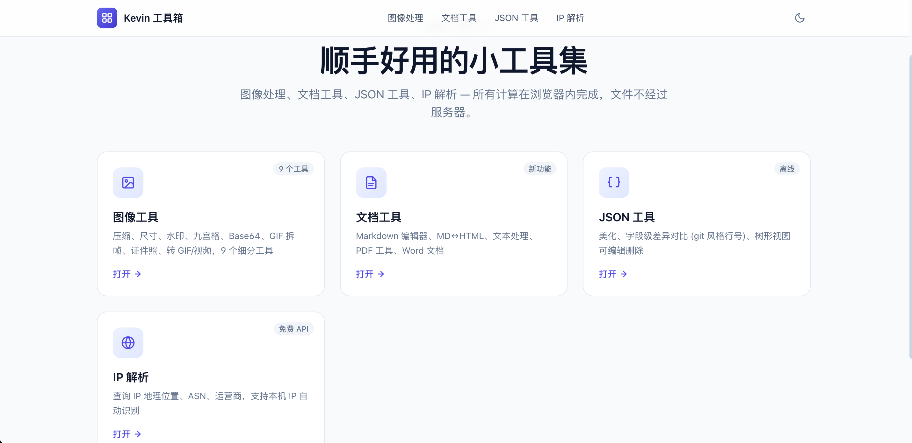
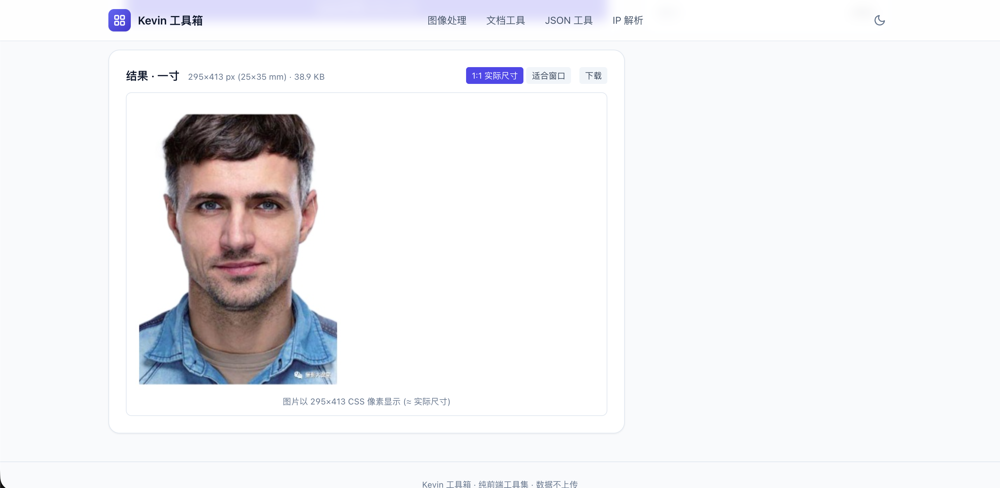
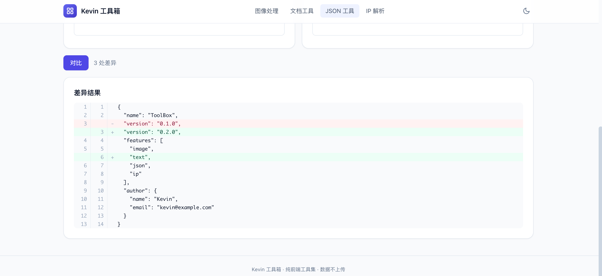
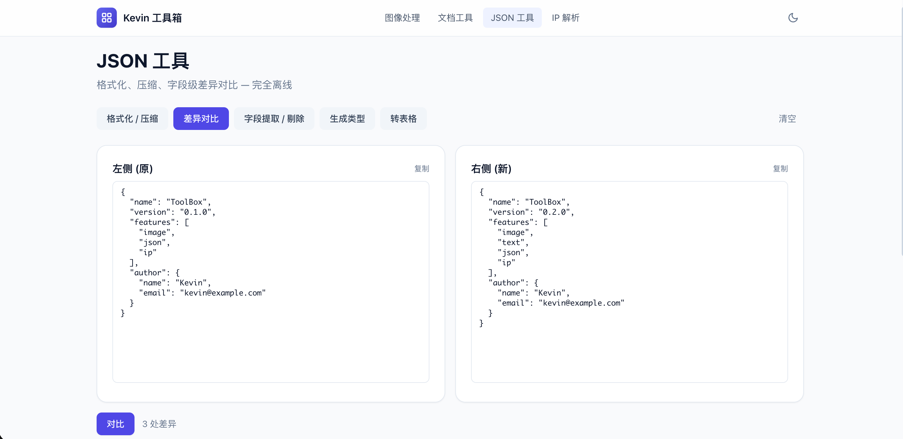
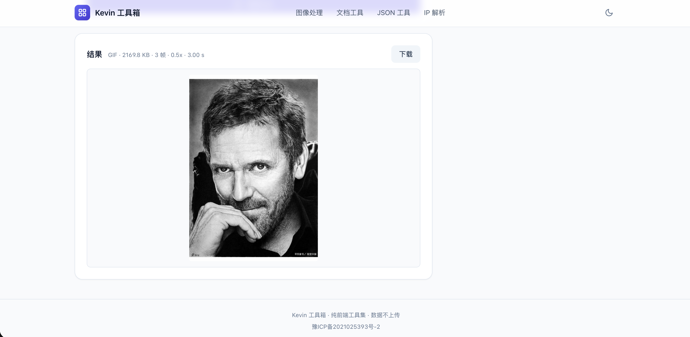
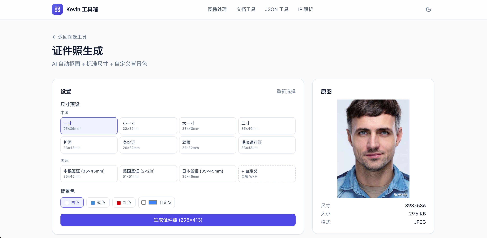

<div align="center">

# ToolBox · 顺手好用的小工具集

**纯前端、零账号、文件不出浏览器**

[🌐 在线体验](https://kevintian.cn) · [📝 更新日志](./CHANGELOG.md) · [🐛 提 Issue](https://github.com/TPF-tian/tool-box/issues) · [💬 讨论](https://github.com/TPF-tian/tool-box/discussions)


</div>

---

## 中文

> 🌐 **在线体验**: <https://kevintian.cn>
> 📖 **English** version below

### 📸 预览

**首页 · 证件照 AI 生成 · JSON 字段级 diff**

<p align="center">
  
  
  
</p>

**JSON 工具 · 图片转 GIF · 证件照配置**

<p align="center">
  
  
  
</p>

> 想要更多截图？见 [docs/screenshots/README.md](./docs/screenshots/README.md)（欢迎 PR 补充）。

### ✨ 项目亮点

- **零上传**：除 IP 解析外，所有图像/文档处理都在浏览器内完成，文件不经过服务器
- **零依赖账号**：打开即用，没有注册、没有登录、没有广告
- **轻量首屏**：Vue 3 SPA + 按需懒加载，首屏 JS < 200KB（gzip）
- **离线可用**：处理流程不依赖网络，断网也能用（OCR / IP 解析除外）
- **深色模式**：跟随系统或手动切换

### 🛠️ 包含工具（18 个）

#### 图像工具（`/image`，9 个）

| 工具 | 路径 | 说明 |
| --- | --- | --- |
| 图片压缩 | `/image/compress` | 调节质量与最大宽度，减小体积 |
| 尺寸修改 | `/image/resize` | 精确宽高 / 按比例缩放，纵横比锁定 |
| 添加水印 | `/image/watermark` | 文字水印，6 种位置 + 平铺 + 旋转 |
| 九宫格切图 | `/image/grid` | 3×3 等分，原图预览 + 单张下载 + 打包 ZIP |
| Base64 转换 | `/image/base64` | 图片 ↔ Base64 字符串互转 |
| GIF 拆帧 | `/image/gif` | 拆出每帧为独立 PNG，ZIP 打包 |
| 证件照生成 | `/image/idphoto` | AI 自动抠图 + 11 种标准尺寸 + 自定义背景 |
| 图片转 GIF | `/image/to-gif` | 多图合成 GIF，支持帧间隔自定义 |
| 图片/GIF 转视频 | `/image/to-video` | 浏览器内 `MediaRecorder` 输出 WebM |

#### 文档工具（`/doc`，5 个）

| 工具 | 路径 | 说明 |
| --- | --- | --- |
| Markdown 编辑器 | `/doc/markdown` | 左编辑右预览，代码高亮，导出 HTML/MD |
| Markdown ↔ HTML | `/doc/convert` | MD→HTML、HTML→MD 双向实时转换 |
| 文本处理 | `/doc/text` | 字符统计、查找替换、正则提取、Unicode、编码转换、diff |
| PDF 工具 | `/doc/pdf` | 合并、拆分、提取页、删除页、重新保存、转图片 |
| Word 文档 | `/doc/word` | .docx ↔ HTML/Markdown/纯文本，HTML → .docx |

#### JSON 工具（`/json`，7 个）

- 格式化 / 压缩（缩进 2 / 4 / Tab）
- 字段级差异对比（git 风格双侧行号）
- 树形视图可编辑删除
- JSONPath 查询
- JSON 修复（容错解析）
- 转表格视图
- 转 TypeScript / JSON Schema 类型定义

#### IP 解析（`/ip`）

- 查询 IP 地理位置、ASN、运营商（[ipwho.is](https://ipwho.is) 免费 API）
- 支持本机 IP 自动识别

### 🧱 技术栈

- **框架**：Vue 3.5 + TypeScript 5.7（严格模式）
- **路由**：Vue Router 4
- **构建**：Vite 6
- **样式**：Tailwind CSS 3 + CSS 变量主题
- **核心库**：
  - `diff` — JSON / 文本行级 diff
  - `gifuct-js` — GIF 拆帧
  - `jszip` — 打包下载
  - `tesseract.js` — OCR 去水印（证件照功能）
  - `markdown-it` + `highlight.js` + `turndown` — Markdown 渲染与互转
  - `pdf-lib` + `pdfjs-dist` — PDF 合并 / 拆分 / 渲染
  - `mammoth` + `docx` — .docx ↔ HTML

### 🚀 本地开发

环境要求：**Node.js ≥ 20**，**pnpm ≥ 9**（npm / yarn 也可，但锁文件是 pnpm 格式）

```bash
# 1. 克隆
git clone https://github.com/TPF-tian/tool-box.git
cd tool-box

# 2. 安装依赖
pnpm install

# 3. 首次跑: 下载 OCR 资源到 public/tesseract/ (11 MB, 一次到位)
pnpm download:tesseract

# 4. 启动 dev server
pnpm dev
# → http://localhost:5173

# 5. 类型检查
pnpm typecheck

# 6. 生产构建
pnpm build

# 7. 预览构建产物
pnpm preview
```

### 🧩 添加新工具

1. 在 `src/utils/` 加业务逻辑（优先纯函数，方便测试）
2. 在 `src/views/` 或 `src/views/image/` 加 Vue 页面
3. 在 `src/router/index.ts` 加路由
4. 在对应导航页（`Home.vue` / `ImageHome.vue` / `DocHome.vue`）加 `ToolCard`

参考 `Compress.vue` + `imageTools.ts` 的最小骨架。

### 📦 部署

#### 纯静态托管（推荐）

`pnpm build` 后把 `dist/` 整个目录上传到任意静态托管（Vercel / Netlify / Cloudflare Pages / 自建 nginx）即可。
证件照功能需要额外跑 AI 抠图后端（见 `deploy/README.md`）。

#### 自托管（nginx + rembg 后端）

参考 [`deploy/README.md`](./deploy/README.md)：

1. `pnpm build` 生成 `dist/`
2. 上传到服务器任意目录
3. 用 `deploy/nginx-models-cache.conf` 模板配 nginx
4. （可选）`sudo bash server/install.sh` 部署 Python 抠图后端

### 🎨 设计取舍

- **不引入 UI 组件库**（Element Plus / Naive UI 等）：单文件组件 + Tailwind 已够，避免依赖膨胀
- **图像处理全 Canvas API**：不依赖第三方图像库，控制权在自己手里
- **WebM 视频而非 MP4**：`MediaRecorder` 浏览器原生输出 WebM（VP8/VP9），要 MP4 需要 `ffmpeg.wasm`（约 30MB）做转码
- **证件照 OCR 走本地资源**：把 `tesseract.js` 的 worker / WASM / 语言包打包到 `public/tesseract/`，首次加载后浏览器缓存，避免依赖外部 CDN
- **证件照 AI 抠图走自托管后端**：`@imgly/background-removal` 浏览器内 ONNX 推理需要下载 ~40MB 模型且吃 CPU，移动端体验差。后端用 `u2netp`（4.4MB）做轻量推理，nginx 反代到 `127.0.0.1:8000`

### 🤝 贡献

欢迎 PR！提交前请阅读 [CONTRIBUTING.md](./CONTRIBUTING.md)。

### 📄 License

[MIT](./LICENSE) © Kevin Tian

---

## English

### 📸 Preview

**Home · ID Photo AI · JSON Field-level Diff**

<p align="center">
  
  
  
</p>

**JSON tool · Image to GIF · ID Photo settings**

<p align="center">
  
  
  
</p>

> Want more screenshots? See [docs/screenshots/README.md](./docs/screenshots/README.md) — PRs welcome.

### ✨ Highlights

- **Zero upload**: all image / document processing runs in-browser, files never leave your device (except IP lookup)
- **No account, no ads, no tracking**: open and use
- **Lightweight SPA**: Vue 3 + route-level code-splitting, ~200KB gzipped for the shell
- **Offline-capable**: processing pipeline doesn't need the network (OCR / IP lookup excepted)
- **Dark mode**: follows OS preference, or toggle manually

### 🛠️ Tools (18)

#### Image tools (`/image`, 9)

| Tool | Path | Description |
| --- | --- | --- |
| Compress | `/image/compress` | Adjust quality / max width, reduce file size |
| Resize | `/image/resize` | Exact dimensions or proportional, aspect-ratio lock |
| Watermark | `/image/watermark` | Text watermark, 6 positions + tiled + rotated |
| Grid crop | `/image/grid` | 3×3 slice, preview + single download + ZIP |
| Base64 | `/image/base64` | Image ↔ Base64 string, data URL or raw |
| GIF splitter | `/image/gif` | Extract every frame as PNG, ZIP bundle |
| ID photo | `/image/idphoto` | AI background removal + 11 preset sizes + custom background |
| Images → GIF | `/image/to-gif` | Multi-image animated GIF, custom frame delay |
| Images / GIF → video | `/image/to-video` | Browser `MediaRecorder`, WebM output |

#### Document tools (`/doc`, 5)

| Tool | Path | Description |
| --- | --- | --- |
| Markdown editor | `/doc/markdown` | Side-by-side edit + preview, code highlighting, export HTML/MD |
| Markdown ↔ HTML | `/doc/convert` | MD→HTML and HTML→MD, live conversion |
| Text utilities | `/doc/text` | Char count, find/replace, regex extract, Unicode, encoding, diff |
| PDF tools | `/doc/pdf` | Merge, split, extract, delete, re-save, render to images |
| Word (.docx) | `/doc/word` | .docx ↔ HTML/Markdown/text, HTML → .docx |

#### JSON tools (`/json`, 7)

- Format / minify (2 / 4 / Tab indent)
- Field-level diff (git-style line numbers)
- Editable tree view
- JSONPath query
- JSON repair (fault-tolerant parse)
- Table view
- Convert to TypeScript / JSON Schema type definitions

#### IP lookup (`/ip`)

- Geo / ASN / ISP query via [ipwho.is](https://ipwho.is)
- Auto-detect your own public IP

### 🧱 Tech Stack

- **Framework**: Vue 3.5 + TypeScript 5.7 (strict)
- **Routing**: Vue Router 4
- **Build**: Vite 6
- **Styling**: Tailwind CSS 3 + CSS variable theming
- **Key libs**: see Chinese section above

### 🚀 Local Development

Requires **Node.js ≥ 20** and **pnpm ≥ 9** (npm / yarn also work, but the lockfile is pnpm format).

```bash
git clone https://github.com/TPF-tian/tool-box.git
cd tool-box
pnpm install
pnpm download:tesseract   # one-time: ~11 MB OCR assets → public/tesseract/
pnpm dev                  # → http://localhost:5173
pnpm typecheck
pnpm build
pnpm preview
```

### 📦 Deployment

Static-only deployment is enough for most tools. The ID-photo feature additionally needs the AI background-removal backend (`server/`). See [`deploy/README.md`](./deploy/README.md) for the full guide.

### 🤝 Contributing

PRs welcome! Read [CONTRIBUTING.md](./CONTRIBUTING.md) first.

### 📄 License

[MIT](./LICENSE) © Kevin Tian

---

<div align="center">

如果这个项目对你有帮助，欢迎 ⭐ **Star** 支持一下！

Made with ❤️ using Vue 3 + Vite

</div>
